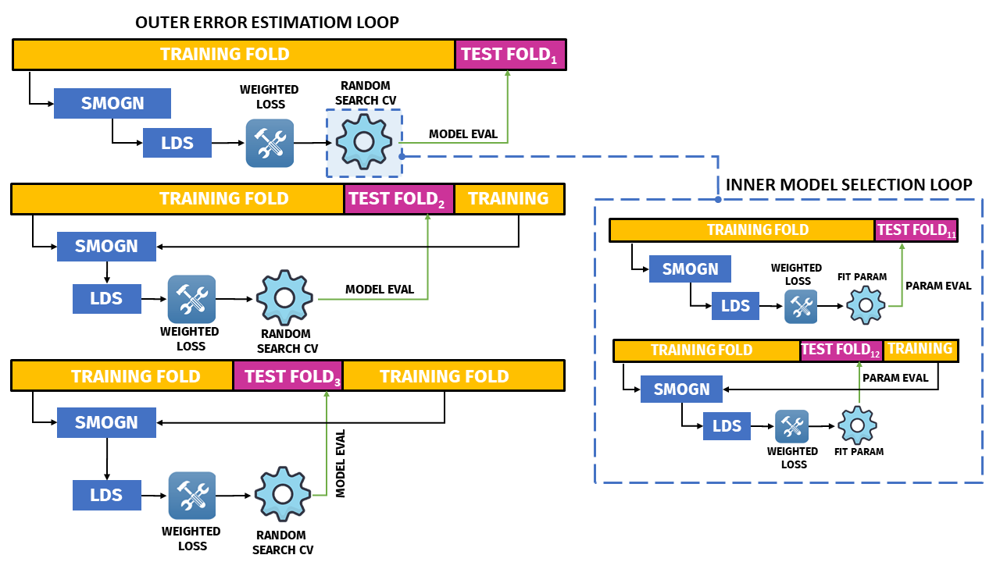

# LOGISTICS: PREDICTING VESSEL DISCHARGE
## INTRODUCTION
This repo shows the data processing and the development of a machine learning model to predict vessel discharge value from a limited dataset ($n\approx1000$) using **XGBoost** regression trees. Please click the open in colab button below: <br>

<a href="https://colab.research.google.com/drive/1jrnRENPoS4zdHjJ-f_X3CUW8TMKGok7d?authuser=1" target="_blank">
  
</a>

or download the notebook in this repo at </br>
 <a href="./Walkthrough_Model_Dev.ipynb" target="_blank">Walkthrough_Model_Dev.ipynb</a> 
</br>

## DATASET
The data is a vessel transshipment record from a global port which logs the a set features of each vessel along with some of the vessels' load and discharge values. Every vessel is characterized by a set of ``21`` features that includes: **{arrival eta, arrival type, leave eta, ship weight, vessel type, stevedores' names, HaMIS,...}**. The task is to predict vessel ``discharge`` based on the provided feature set.

### MISSING TARGET DATA
The initial size of the dataset is ``8208`` points with only a total of ``1184`` known vessel ``discharge`` values and a mere ``515`` known vessel load values.
<p align="center">
    </br>
    <i>Missing data matrix</i></br>
</p>

The record logs ``3`` vessel types encoded numerically from the set ``{2, 3, 5}``. Below is a breakdown of missing data and total target values per vessel type.

<p align="center">
    
    </br>
    </br>
    <i><b>Top left</b>: Null counts per vessel type | <b>Top right</b>: Discharge/Load sums per vessel type </br> <b>Bottom</b>: KDEs of discharge & load values </i> </br>
</p>

The graphs show that despite vessel type ``5`` harbors most of the missing data values, it also has the greatest values for ``discharge`` and ``load``.
## REGRESSION IMBALANCE
The dataset contains a significant imbalance both in the feature space and the target space, for each vessel type. Both the feature and target spaces over-represent vessel type ``5`` which also has the greatest target values. Below, the graphs show the count distributions over the feature and target spaces.

<p align="center">
    
    </br>
    <i><b>Top left</b>: Load values distribution per vessel type | <b>Top right</b>: Discharge values distribution per vessel type </br> <b>Bottom</b>: Count of targets and rows per vessel type </i> </br>
</p>

To overcome the imbalance in the feature and target space, two methods were applied:
1. <a href="https://proceedings.mlr.press/v74/branco17a.html" target="_blank"> Synthetic Minority Over-Sampling with Gaussian Noise (SMOGN)</a>

2. <a href="https://arxiv.org/abs/2102.0955" target="_blank">Label Distribution Smoothing with sample-weighted loss (LDS)</a>
### 1. SMOGN
SMOGN was applied on the training splits to balance both the feature and target spaces. The validation and test sets were left intact. Below is a comparison between the original training target space ``y_train`` before and after applying SMOGN.

<p align="center">
    </br>
    <i> Distribution of y_train before/after SMOGN</i> </br>
</p>

The distribution now is more balanced with less skewness.

### 2. LDS
After applying SMOGN on the training split. An new ***effective labels distribution*** was derived from the original ***empirical label distribution*** (i.e., y_train histogram) using a ***1D convolution*** ```gaussian``` kernel to ***smooth*** the gaps in the original distribution. Below are the empirical and smoothed effective distributions for the label space ``y_train``.

<p align="center">
    </br>
    <i><b>Top</b>: Empirical y_train distribution | <b>Bottom</b>: Effective smoothed y_train distribution (LDS) </i> </br>
</p>

#### <b>INVERSE FREQUENCY WEIGHTS</b>
From the resulting effective distribution, individual instance weights were calculated, such that:<br> *weight_i = 1/freq_i*, where *freq* is the instance *i* frequency from the new ***LDS distribution***. Below is the computed sample inverse weights data frame.
<p align="center">
    </br>
    <i>Inverse frequency weights per discharge value in y_train </i> </br>
</p>

#### <b>XGBOOST: WEIGHTED SQUARED LOSS </b>
Using the obtained weights we can weight the ``squared loss`` function to make  the model training adjust to data imbalance. In ``XGboost`` the gradient and hessians of the new weighted loss will be: <br>

*Gradient_i = (ytrue_i - ypred_i) x weight_i* <br>
*Hessian_i = 1 x weight_i* <br>

## INTEGRATED MODEL DEVELOPMENT & DATA BALANCING PIPELINE
Due to the small size of of the dataset, a nested cross validation (CV)procedure was implemented to perform model selection (i.e., parameter tuning) while estimating the test error. This process is necessary to reduce the uncertainty (i.e, variance) of the test error.

The pipeline was composed of an inner CV random search loop of ```k = 4``` folds, inside an outer error estimation loop of ``k = 4`` folds. The parameter search was done over ``30`` random configurations of the booster parameters.

### METHODOLOGICAL REQUIREMENT
The balancing procedure (i.e., SMOGN + LDS) was integrated within the nested cross validation process such that for each CV iteration, the balancing pipeline was called only on the training fold, while sparing validation and test folds intact. This is maintained through both the inner model selection loop and the outer error estimation loop. Following this procedure prevents the over-optimistic evaluation of the true test error. Below is an illustration of the integrated pipeline for 3 iterations folds.

<p align="center">
    </br>
    <i><b>Integrated pipeline</b></br>
    SMOGN + LDS process within the nested cross-validation </i> </br>
</p>

<br>

## RESULTS
Below are the test error estimation of the best models selected from the pipelines:

<p align="center">
    </br>
    <i>
    The final estimates of the test error</i> </br>
</p>

### The best model was found to have the following parameters:
``` 
{'base_score': 0.5,
 'booster': 'gbtree',
 'colsample_bylevel': 1,
 'colsample_bynode': 1,
 'colsample_bytree': 0.8801672539105327,
 'eval_metric': ['mae', 'rmse'],
 'gamma': 10.182123584678035,
 'gpu_id': -1,
 'interaction_constraints': '',
 'learning_rate': 0.019437673150966728,
 'max_delta_step': 0,
 'max_depth': 16,
 'min_child_weight': 4,
 'monotone_constraints': '()',
 'n_jobs': 2,
 'num_parallel_tree': 1,
 'predictor': 'auto',
 'random_state': 32,
 'reg_alpha': 0,
 'reg_lambda': 6.261495311486096,
 'scale_pos_weight': 1,
 'seed': 32,
 'subsample': 0.7212236249826819,
 'tree_method': 'exact',
 'validate_parameters': True,
 'verbosity': 1}
 ```
### The features had the following weights:
<p align="center">
    </br>
    <i>Feature importance plot</br>
</p>

